# SKILLY — Comprehensive Database Schema Design & Technical Specifications

---

## 1. Executive Summary & Purpose

This document provides the definitive, implementation-ready database architecture for **SKILLY** — an Academia–Industry collaboration platform connecting Students, Colleges/TPOs, Teachers/Trainers, Industry/Companies, and Alumni/Mentors across the end-to-end lifecycle:

$$\text{Skill Assessment} \longrightarrow \text{Skill Gap} \longrightarrow \text{Roadmap} \longrightarrow \text{Training} \longrightarrow \text{Internship} \longrightarrow \text{Mentorship} \longrightarrow \text{Placement} \longrightarrow \text{Career Growth}$$

### Architectural Goal
- Relational Schema designed with **Third Normal Form (3NF)** normalization principles
- **Target Database Engine**: PostgreSQL 15+
- **ORM Target**: SQLAlchemy 2.0 (Python / FastAPI)
- **Migration Framework**: Alembic
- **Vector Extension Target**: `pgvector` for AI embeddings & semantic search
- Strict composite foreign key constraints for multi-tenant academic integrity, auditable state history, optimized B-tree/GIN/HNSW indexing, and integrity-verifiable digital evidence records.

---

## 2. Database Design Principles

1. **3NF Normalization Principles**: Attributes are positioned to depend directly on their respective entity primary keys, avoiding data duplication and update anomalies while maintaining relational integrity.
2. **Canonical Data Integrity**: Universal entities (Skills, Career Roles, Institutions, Companies) are deduplicated into authoritative master catalogs.
3. **Role-Based Entity Separation**: Identity credentials reside in `users`, shared metadata in `user_profiles`, and domain-specific roles in separate extension tables (`students`, `teachers`, `institution_staff`, `company_users`).
4. **Hierarchical Multi-Tenant Integrity**: Academic departmental references enforce composite foreign keys `(institution_id, department_id)` referencing `departments(institution_id, id)` to prevent cross-institution department assignment anomalies.
5. **Auditable & Integrity-Verifiable Evidence**: Transactional records include immutable audit history where state transitions occur, and records with verification hashes provide integrity-verifiable digital evidence.
6. **Decoupled Polymorphic References**: High-dimensional vector representations (`embeddings`), activity notifications (`notifications`), and multi-type credentials (`skill_evidence`) utilize controlled polymorphic references with service-layer validation to maintain clean OLTP index footprints.

---

## 3. Module → Entity Mapping

| Module Number | Official Module Name | Database Entities Supported |
| :---: | :--- | :--- |
| **01** | **Public Website** | Read-only access to `skills`, `career_roles`, `institutions`, `companies`, `competitions` |
| **02** | **Authentication & RBAC** | `users`, `user_profiles` |
| **03** | **Student** | `students`, `student_skills`, `skill_gaps`, `roadmaps`, `roadmap_items` |
| **04** | **College / TPO** | `institutions`, `departments`, `institution_staff`, `activities`, `placement_records` |
| **05** | **Teacher / Trainer** | `teachers`, `training_programs`, `training_enrollments` |
| **06** | **Industry / Company** | `companies`, `company_users`, `opportunities`, `opportunity_skills` |
| **07** | **Alumni / Mentor** | `mentor_connections`, `mentorship_sessions` |
| **08** | **Skill & Assessment** | `skills`, `skill_relationships`, `assessments`, `assessment_questions`, `assessment_attempts` |
| **09** | **Internship & Placement** | `applications`, `application_status_history`, `internships`, `internship_progress`, `internship_evaluations`, `placement_records`, `placement_interactions` |
| **10** | **Portfolio & Achievements** | `portfolio_items`, `recognitions`, `resume_versions`, `skill_evidence` |
| **11** | **Community & Networking** | `community_posts`, `community_comments`, `peer_skill_requests` |
| **12** | **Notifications** | `notifications` |
| **13** | **AI / Recommendations** | `embeddings` (supports semantic matching across skills, students, careers, and opportunities) |
| **Ext 1** | **Competitions & Hackathons** | `competitions`, `competition_participants`, `competition_teams`, `competition_team_members` |

---

## 4. Entity Candidate Review & Classification

Every candidate table has been evaluated against domain requirements, relational integrity, and normalization criteria.

| Entity Candidate | Classification | Analysis & Decision Justification |
| :--- | :---: | :--- |
| `users` | **KEEP** | Essential root authentication and credential table with unique email/username and role enumeration. |
| `user_profiles` | **KEEP** | 1-to-1 extension isolating personal metadata (avatar, phone, bio, location) from authentication logic. |
| `institutions` | **KEEP** | Authoritative college/university entity for academic affiliation, TPO operations, and accreditation. |
| `departments` | **KEEP** | Normalizes academic branches; enhanced with `UNIQUE (institution_id, id)` for composite FK enforcement. |
| `students` | **KEEP** | Dedicated student domain model holding roll numbers, semester, CGPA, target career, and composite FK `(institution_id, department_id)`. |
| `teachers` | **KEEP** | Dedicated faculty/trainer model tracking designations, specializations, and composite FK `(institution_id, department_id)`. |
| `institution_staff` | **KEEP** | Dedicated model for TPOs and Deans managing campus placement drives and institutional reporting. |
| `companies` | **KEEP** | Master enterprise entity containing verified corporate profile, industry domain, and logos. |
| `company_users` | **KEEP** | Junction linking specific recruiters and hiring managers to an enterprise. |
| `opportunities` | **KEEP** | Centralized posting model for internships, full-time jobs, and project opportunities. |
| `opportunity_skills` | **KEEP** | Junction table mapping required skills, proficiency cutoffs, and mandatory flags to an opportunity. |
| `skills` | **KEEP** | Canonical skill taxonomy avoiding duplicate skill names across the platform. |
| `skill_relationships` | **KEEP** | Directed Skill Relationship Graph representing prerequisites, specializations, and related skill links. |
| `student_skills` | **KEEP** | Student-specific competency table recording proficiency level, assessment scores, and verification status. |
| `skill_evidence` | **KEEP** | Integrity-verifiable digital evidence records using controlled polymorphic references. |
| `career_roles` | **KEEP** | Standardized industry role definitions (e.g. Full Stack Engineer, Cloud Architect). |
| `career_role_skills` | **KEEP** | Benchmark competency matrices defining skills required for each career role. |
| `assessments` | **KEEP** | Assessment definition catalog for diagnostic quizzes, coding challenges, and corporate cutoffs. |
| `assessment_questions` | **KEEP** | Normalized question bank holding MCQs, coding prompts, options, and point allocations. |
| `assessment_attempts` | **KEEP** | Individual student test session tracking scores, completion timestamps, and immutable JSONB response snapshot. |
| `skill_gaps` | **KEEP** | Calculated delta between current student skills and target career role requirements. |
| `roadmaps` | **KEEP** | Personalized multi-phase career learning trajectory generated for a student. |
| `roadmap_items` | **KEEP** | Sequential milestones within a roadmap tracking completion status, resources, and checkpoints. |
| `training_programs` | **KEEP** | Formal training courses, workshops, FDPs, and bootcamps created by faculty or industry. |
| `training_enrollments` | **KEEP** | Student enrollment in training programs tracking attendance, progress, and certification. |
| `applications` | **KEEP** | Core ATS application record tracking student applications and authoritative `current_status`. |
| `application_status_history` | **KEEP** | Append-only immutable audit log recording recruitment state transitions (Applied $\to$ Shortlisted $\to$ Offered). |
| `internships` | **KEEP** | Active/completed internship contract model tracking dates, supervisor user FK, and contact snapshot fields. |
| `internship_progress` | **KEEP** | Periodic milestone logs and weekly reports submitted by student interns. |
| `internship_evaluations` | **KEEP** | Formal industry supervisor evaluations providing verified skill ratings and rubrics. |
| `placement_records` | **KEEP** | Institutional placement outcome model storing packages, offer letters, and NAAC/TPO exports. |
| `placement_interactions` | **KEEP** | Scheduled recruitment interaction events (Campus Drives, GDs, Technical Interviews). |
| `portfolio_items` | **KEEP** | Structured showcase items (projects, research papers, open-source work) on student profile. |
| `recognitions` | **KEEP** | Verified digital badges, hackathon honors, and institutional milestone recognitions with verification hashes. |
| `resume_versions` | **KEEP** | Versioned resume uploads and parsed JSON resumes tailored to specific roles. |
| `mentor_connections` | **KEEP** | Formal 1-on-1 mentorship link established between a student and an alumnus/mentor. |
| `mentorship_sessions` | **KEEP** | Individual scheduled sessions under a connection; normalized by referencing `connection_id` directly. |
| `activities` | **KEEP** | Institutional events, webinars, guest lectures, and departmental schedules. |
| `community_posts` | **KEEP** | Collaborative discussion threads, query posts, and resource sharing. |
| `community_comments` | **KEEP** | Threaded discussion comments and nested peer responses. |
| `peer_skill_requests` | **KEEP** | Peer skill exchange marketplace ("I can help with X" / "I want to learn Y"). |
| `competitions` | **KEEP** | Master competition/hackathon entity with timelines, rules, prizes, and `track_type` participation modes. |
| `competition_participants` | **KEEP** | Registered individual participants tracking submissions, scores, ranks, and awards. |
| `competition_teams` | **KEEP** | Student hackathon teams tracking team leader, submissions, scoring, and ranking. |
| `competition_team_members` | **KEEP** | Junction table mapping students into competition teams with specific roles. |
| `embeddings` | **KEEP** | Polymorphic vector table for semantic skill matching, opportunity recommendations, and AI search (`vector(1536)`). |
| `notifications` | **KEEP** | Multi-channel user notification log with read receipts and controlled polymorphic entity references. |

### Classification Totals:
- **Total Candidate Entities Evaluated**: 47
- **Tables Kept (Designed with 3NF Principles)**: **47**
- **Tables Merged**: 0 (avoided denormalization and repeating columns)
- **Tables Removed**: 0 (all 47 tables represent genuine SKILLY functional modules)
- **Tables Newly Added**: 0 (existing 47 candidates encompass the full platform scope)

---

## 5. Detailed Table Specifications

### 5.1 Identity, Authentication & Profiles

#### 1. `users`
- **Purpose**: Core authentication record for all SKILLY stakeholders.
- **Why Required**: Centralizes login credentials, active status, role enum, and security tokens.
- **Columns**:
  - `id`: `UUID` (PK, default: `gen_random_uuid()`)
  - `email`: `VARCHAR(255)` (NOT NULL, UNIQUE)
  - `username`: `VARCHAR(100)` (NOT NULL, UNIQUE)
  - `hashed_password`: `VARCHAR(255)` (NOT NULL)
  - `role`: `VARCHAR(50)` (NOT NULL) — `['STUDENT', 'COLLEGE_ADMIN', 'TPO', 'TEACHER', 'TRAINER', 'INDUSTRY', 'ALUMNI', 'MENTOR']`
  - `is_active`: `BOOLEAN` (NOT NULL, default: `TRUE`)
  - `is_verified`: `BOOLEAN` (NOT NULL, default: `FALSE`)
  - `created_at`: `TIMESTAMP WITH TIME ZONE` (NOT NULL, default: `NOW()`)
  - `updated_at`: `TIMESTAMP WITH TIME ZONE` (NOT NULL, default: `NOW()`)
- **Indexes**:
  - `idx_users_email` (BTREE on `email`)
  - `idx_users_username` (BTREE on `username`)
  - `idx_users_role` (BTREE on `role`)

#### 2. `user_profiles`
- **Purpose**: General biographical and contact information shared across all user types.
- **Why Required**: Prevents bloat in `users` table and isolates personal profile attributes.
- **Columns**:
  - `id`: `UUID` (PK, default: `gen_random_uuid()`)
  - `user_id`: `UUID` (NOT NULL, UNIQUE, FK $\to$ `users.id` ON DELETE CASCADE)
  - `first_name`: `VARCHAR(100)` (NOT NULL)
  - `last_name`: `VARCHAR(100)` (NOT NULL)
  - `avatar_url`: `TEXT` (NULLABLE)
  - `phone`: `VARCHAR(30)` (NULLABLE)
  - `bio`: `TEXT` (NULLABLE)
  - `city`: `VARCHAR(100)` (NULLABLE)
  - `state`: `VARCHAR(100)` (NULLABLE)
  - `country`: `VARCHAR(100)` (NULLABLE, default: `'India'`)
  - `linkedin_url`: `TEXT` (NULLABLE)
  - `github_url`: `TEXT` (NULLABLE)
  - `website_url`: `TEXT` (NULLABLE)
  - `created_at`: `TIMESTAMP WITH TIME ZONE` (NOT NULL, default: `NOW()`)
  - `updated_at`: `TIMESTAMP WITH TIME ZONE` (NOT NULL, default: `NOW()`)
- **Indexes**:
  - `idx_user_profiles_user_id` (BTREE on `user_id`)
  - `idx_user_profiles_name` (BTREE on `last_name, first_name`)

---

### 5.2 Academic Structure & Roles

#### 3. `institutions`
- **Purpose**: Master catalog of partner colleges, universities, and academic institutions.
- **Why Required**: Manages collegiate hierarchy, TPO administration, and accreditation data.
- **Columns**:
  - `id`: `UUID` (PK, default: `gen_random_uuid()`)
  - `name`: `VARCHAR(255)` (NOT NULL)
  - `code`: `VARCHAR(50)` (NOT NULL, UNIQUE)
  - `institution_type`: `VARCHAR(50)` (NOT NULL, default: `'COLLEGE'`) — `['UNIVERSITY', 'AUTONOMOUS_COLLEGE', 'AFFILIATED_COLLEGE', 'POLYTECHNIC']`
  - `website`: `TEXT` (NULLABLE)
  - `logo_url`: `TEXT` (NULLABLE)
  - `address`: `TEXT` (NULLABLE)
  - `city`: `VARCHAR(100)` (NOT NULL)
  - `state`: `VARCHAR(100)` (NOT NULL)
  - `country`: `VARCHAR(100)` (NOT NULL, default: `'India'`)
  - `is_accredited`: `BOOLEAN` (NOT NULL, default: `TRUE`)
  - `created_at`: `TIMESTAMP WITH TIME ZONE` (NOT NULL, default: `NOW()`)
- **Indexes**:
  - `idx_institutions_code` (BTREE on `code`)
  - `idx_institutions_state_city` (BTREE on `state, city`)

#### 4. `departments`
- **Purpose**: Academic departments within an institution (e.g. Computer Engineering, IT, Mechanical).
- **Why Required**: Normalizes departmental student batches and faculty allocations, supporting composite foreign keys.
- **Columns**:
  - `id`: `UUID` (PK, default: `gen_random_uuid()`)
  - `institution_id`: `UUID` (NOT NULL, FK $\to$ `institutions.id` ON DELETE CASCADE)
  - `name`: `VARCHAR(150)` (NOT NULL)
  - `code`: `VARCHAR(50)` (NOT NULL)
  - `created_at`: `TIMESTAMP WITH TIME ZONE` (NOT NULL, default: `NOW()`)
- **Constraints**:
  - `uq_institution_department_code` UNIQUE (`institution_id, code`)
  - `uq_institution_department_id` UNIQUE (`institution_id, id`) — *Required target for composite foreign keys from `students` and `teachers`*
- **Indexes**:
  - `idx_departments_institution_id` (BTREE on `institution_id`)

#### 5. `students`
- **Purpose**: Student domain profile storing academic metrics, roll numbers, and target career objectives.
- **Why Required**: Enforces multi-tenant academic integrity through composite foreign keys.
- **Columns**:
  - `id`: `UUID` (PK, default: `gen_random_uuid()`)
  - `user_id`: `UUID` (NOT NULL, UNIQUE, FK $\to$ `users.id` ON DELETE CASCADE)
  - `institution_id`: `UUID` (NOT NULL, FK $\to$ `institutions.id` ON DELETE RESTRICT)
  - `department_id`: `UUID` (NOT NULL)
  - `roll_number`: `VARCHAR(50)` (NOT NULL)
  - `enrollment_year`: `INTEGER` (NOT NULL)
  - `graduation_year`: `INTEGER` (NOT NULL)
  - `current_semester`: `INTEGER` (NOT NULL)
  - `cgpa`: `NUMERIC(4, 2)` (NULLABLE)
  - `target_career_role_id`: `UUID` (NULLABLE, FK $\to$ `career_roles.id` ON DELETE SET NULL)
  - `created_at`: `TIMESTAMP WITH TIME ZONE` (NOT NULL, default: `NOW()`)
  - `updated_at`: `TIMESTAMP WITH TIME ZONE` (NOT NULL, default: `NOW()`)
- **Constraints**:
  - `uq_institution_student_roll` UNIQUE (`institution_id, roll_number`)
  - `fk_student_institution_dept` FOREIGN KEY (`institution_id, department_id`) REFERENCES `departments(institution_id, id)` ON DELETE RESTRICT
  - `chk_students_semester` CHECK (`current_semester > 0`)
  - `chk_students_cgpa` CHECK (`cgpa IS NULL OR (cgpa >= 0.00 AND cgpa <= 10.00)`)
  - `chk_students_graduation` CHECK (`graduation_year >= enrollment_year`)
- **Design Rationale**:
  > The composite foreign key `(institution_id, department_id)` references `departments(institution_id, id)`. This strictly prevents invalid data states where a student is registered with Institution A while assigned a department ID belonging to Institution B.
- **Indexes**:
  - `idx_students_institution_dept` (BTREE on `institution_id, department_id`)
  - `idx_students_graduation_year` (BTREE on `graduation_year`)
  - `idx_students_target_role` (BTREE on `target_career_role_id`)

#### 6. `teachers`
- **Purpose**: Faculty and trainer domain profile.
- **Why Required**: Manages instructors, coursework advisors, and corporate trainers with composite institutional department integrity.
- **Columns**:
  - `id`: `UUID` (PK, default: `gen_random_uuid()`)
  - `user_id`: `UUID` (NOT NULL, UNIQUE, FK $\to$ `users.id` ON DELETE CASCADE)
  - `institution_id`: `UUID` (NOT NULL, FK $\to$ `institutions.id` ON DELETE RESTRICT)
  - `department_id`: `UUID` (NOT NULL)
  - `designation`: `VARCHAR(100)` (NOT NULL)
  - `employee_id`: `VARCHAR(50)` (NULLABLE)
  - `specialization`: `TEXT` (NULLABLE)
  - `is_trainer`: `BOOLEAN` (NOT NULL, default: `FALSE`)
  - `created_at`: `TIMESTAMP WITH TIME ZONE` (NOT NULL, default: `NOW()`)
- **Constraints**:
  - `fk_teacher_institution_dept` FOREIGN KEY (`institution_id, department_id`) REFERENCES `departments(institution_id, id)` ON DELETE RESTRICT
- **Design Rationale**:
  > Enforces that a teacher's assigned department strictly belongs to their respective institution.
- **Indexes**:
  - `idx_teachers_institution_dept` (BTREE on `institution_id, department_id`)
  - `idx_teachers_is_trainer` (BTREE on `is_trainer`)

#### 7. `institution_staff`
- **Purpose**: Operational management staff for colleges (TPOs, Deans, Placement Officers).
- **Why Required**: Controls campus drive scheduling, batch shortlisting, and accreditation exports.
- **Columns**:
  - `id`: `UUID` (PK, default: `gen_random_uuid()`)
  - `user_id`: `UUID` (NOT NULL, UNIQUE, FK $\to$ `users.id` ON DELETE CASCADE)
  - `institution_id`: `UUID` (NOT NULL, FK $\to$ `institutions.id` ON DELETE CASCADE)
  - `staff_role`: `VARCHAR(50)` (NOT NULL) — `['TPO', 'COLLEGE_ADMIN', 'DEAN', 'PLACEMENT_COORDINATOR']`
  - `employee_id`: `VARCHAR(50)` (NULLABLE)
  - `created_at`: `TIMESTAMP WITH TIME ZONE` (NOT NULL, default: `NOW()`)
- **Indexes**:
  - `idx_institution_staff_inst_role` (BTREE on `institution_id, staff_role`)

---

### 5.3 Industry & Corporate Entities

#### 8. `companies`
- **Purpose**: Verified employer and industry partner entity.
- **Why Required**: Holds corporate identity, industry domains, and posting permissions.
- **Columns**:
  - `id`: `UUID` (PK, default: `gen_random_uuid()`)
  - `name`: `VARCHAR(255)` (NOT NULL, UNIQUE)
  - `industry_type`: `VARCHAR(100)` (NOT NULL) — `['INFORMATION_TECHNOLOGY', 'CORE_ENGINEERING', 'FINANCE', 'HEALTHCARE', 'MANUFACTURING', 'CONSULTING']`
  - `company_size`: `VARCHAR(50)` (NULLABLE) — `['STARTUP', 'MID_SIZE', 'ENTERPRISE', 'MULTINATIONAL']`
  - `website`: `TEXT` (NULLABLE)
  - `logo_url`: `TEXT` (NULLABLE)
  - `headquarters`: `VARCHAR(150)` (NULLABLE)
  - `description`: `TEXT` (NULLABLE)
  - `is_verified`: `BOOLEAN` (NOT NULL, default: `FALSE`)
  - `created_at`: `TIMESTAMP WITH TIME ZONE` (NOT NULL, default: `NOW()`)
- **Indexes**:
  - `idx_companies_name` (BTREE on `name`)
  - `idx_companies_industry_type` (BTREE on `industry_type`)

#### 9. `company_users`
- **Purpose**: Recruiter, hiring manager, and interviewer staff associated with a company.
- **Why Required**: Maps authenticated company users to corporate ATS and posting features.
- **Columns**:
  - `id`: `UUID` (PK, default: `gen_random_uuid()`)
  - `user_id`: `UUID` (NOT NULL, UNIQUE, FK $\to$ `users.id` ON DELETE CASCADE)
  - `company_id`: `UUID` (NOT NULL, FK $\to$ `companies.id` ON DELETE CASCADE)
  - `designation`: `VARCHAR(100)` (NOT NULL)
  - `hr_role`: `VARCHAR(50)` (NOT NULL, default: `'RECRUITER'`) — `['ADMIN', 'RECRUITER', 'INTERVIEWER', 'SUPERVISOR']`
  - `created_at`: `TIMESTAMP WITH TIME ZONE` (NOT NULL, default: `NOW()`)
- **Indexes**:
  - `idx_company_users_company_id` (BTREE on `company_id`)

---

### 5.4 Canonical Skill Taxonomy & Directed Relationship Graph

#### 10. `skills`
- **Purpose**: Authoritative master dictionary of all technical and soft skills.
- **Why Required**: Eliminates duplicate skill naming and serves as the platform's core ontology.
- **Columns**:
  - `id`: `UUID` (PK, default: `gen_random_uuid()`)
  - `name`: `VARCHAR(150)` (NOT NULL, UNIQUE)
  - `slug`: `VARCHAR(150)` (NOT NULL, UNIQUE)
  - `category`: `VARCHAR(50)` (NOT NULL) — `['PROGRAMMING', 'FRAMEWORK', 'DATABASE', 'CORE_ENGINEERING', 'CLOUD_DEVOPS', 'UI_UX', 'CYBERSECURITY', 'DATA_AI', 'SOFT_SKILL']`
  - `description`: `TEXT` (NULLABLE)
  - `is_verified`: `BOOLEAN` (NOT NULL, default: `TRUE`)
  - `created_at`: `TIMESTAMP WITH TIME ZONE` (NOT NULL, default: `NOW()`)
- **Indexes**:
  - `idx_skills_slug` (BTREE on `slug`)
  - `idx_skills_category` (BTREE on `category`)

#### 11. `skill_relationships`
- **Purpose**: Directed Skill Relationship Graph linking prerequisite, related, and specialized skills.
- **Why Required**: Models dependencies and connections across the skill ontology.
- **Columns**:
  - `id`: `UUID` (PK, default: `gen_random_uuid()`)
  - `parent_skill_id`: `UUID` (NOT NULL, FK $\to$ `skills.id` ON DELETE CASCADE)
  - `child_skill_id`: `UUID` (NOT NULL, FK $\to$ `skills.id` ON DELETE CASCADE)
  - `relationship_type`: `VARCHAR(50)` (NOT NULL) — `['PREREQUISITE', 'RELATED', 'SPECIALIZATION']`
- **Constraints**:
  - `uq_skill_relationship` UNIQUE (`parent_skill_id, child_skill_id, relationship_type`)
  - `chk_no_self_relationship` CHECK (`parent_skill_id != child_skill_id`)
- **Design & Semantics**:
  > - **PREREQUISITE**: Directional dependency ($A \to B$ means skill $A$ is a prerequisite for skill $B$). Prerequisite cycles must be prevented by service-layer validation or a recursive trigger.
  > - **SPECIALIZATION**: Directional taxonomy ($B$ is a specialized sub-domain of $A$).
  > - **RELATED**: General semantic association (non-hierarchical association between related topics; may be queried in either direction or stored as bidirectional pairs).
- **Indexes**:
  - `idx_skill_rel_parent` (BTREE on `parent_skill_id`)
  - `idx_skill_rel_child` (BTREE on `child_skill_id`)

#### 12. `student_skills`
- **Purpose**: Current assessed and self-reported competencies for individual students.
- **Why Required**: Acts as the dynamic skill state used for role matching, gaps, and ATS.
- **Columns**:
  - `id`: `UUID` (PK, default: `gen_random_uuid()`)
  - `student_id`: `UUID` (NOT NULL, FK $\to$ `students.id` ON DELETE CASCADE)
  - `skill_id`: `UUID` (NOT NULL, FK $\to$ `skills.id` ON DELETE RESTRICT)
  - `proficiency_level`: `VARCHAR(50)` (NOT NULL, default: `'BEGINNER'`) — `['BEGINNER', 'INTERMEDIATE', 'ADVANCED', 'EXPERT']`
  - `verification_status`: `VARCHAR(50)` (NOT NULL, default: `'SELF_REPORTED'`) — `['SELF_REPORTED', 'ASSESSED', 'VERIFIED_BY_PROJECT', 'VERIFIED_BY_INTERNSHIP']`
  - `score`: `NUMERIC(5, 2)` (NULLABLE) — Normalized 0–100 scale
  - `confidence_score`: `NUMERIC(3, 2)` (NULLABLE) — 0.00–1.00 confidence rating
  - `last_assessed_at`: `TIMESTAMP WITH TIME ZONE` (NULLABLE)
  - `created_at`: `TIMESTAMP WITH TIME ZONE` (NOT NULL, default: `NOW()`)
  - `updated_at`: `TIMESTAMP WITH TIME ZONE` (NOT NULL, default: `NOW()`)
- **Constraints**:
  - `uq_student_skill` UNIQUE (`student_id, skill_id`)
  - `chk_student_skills_score` CHECK (`score IS NULL OR (score >= 0.00 AND score <= 100.00)`)
  - `chk_student_skills_conf` CHECK (`confidence_score IS NULL OR (confidence_score >= 0.00 AND confidence_score <= 1.00)`)
- **Indexes**:
  - `idx_student_skills_lookup` (BTREE on `student_id, skill_id`)
  - `idx_student_skills_status` (BTREE on `verification_status`)

#### 13. `skill_evidence`
- **Purpose**: Verified digital evidence backing evaluated student skills.
- **Why Required**: Provides auditable and integrity-verifiable evidence linking repositories, assessments, evaluations, and certificates.
- **Columns**:
  - `id`: `UUID` (PK, default: `gen_random_uuid()`)
  - `student_skill_id`: `UUID` (NOT NULL, FK $\to$ `student_skills.id` ON DELETE CASCADE)
  - `evidence_type`: `VARCHAR(50)` (NOT NULL) — `['ASSESSMENT_ATTEMPT', 'INTERNSHIP_EVALUATION', 'PROJECT_REPO', 'CERTIFICATE', 'HACKATHON_BADGE']`
  - `reference_id`: `UUID` (NULLABLE) — *Polymorphic reference ID*
  - `title`: `VARCHAR(255)` (NOT NULL)
  - `url`: `TEXT` (NULLABLE)
  - `verified_by_user_id`: `UUID` (NULLABLE, FK $\to$ `users.id` ON DELETE SET NULL)
  - `verified_at`: `TIMESTAMP WITH TIME ZONE` (NULLABLE)
  - `created_at`: `TIMESTAMP WITH TIME ZONE` (NOT NULL, default: `NOW()`)
- **Design Rationale**:
  > `reference_id` is a controlled polymorphic reference and cannot be enforced through a standard database foreign key because it points to different entity types based on `evidence_type`. Referential validation must be performed in the service layer.
- **Indexes**:
  - `idx_skill_evidence_student_skill` (BTREE on `student_skill_id`)
  - `idx_skill_evidence_ref` (BTREE on `evidence_type, reference_id`)

---

### 5.5 Career Roles, Gap Analysis & Roadmaps

#### 14. `career_roles`
- **Purpose**: Standardized target career benchmark definitions.
- **Why Required**: Establishes industry-standard target roles (e.g. Full Stack Engineer, Cloud Architect).
- **Columns**:
  - `id`: `UUID` (PK, default: `gen_random_uuid()`)
  - `title`: `VARCHAR(150)` (NOT NULL, UNIQUE)
  - `slug`: `VARCHAR(150)` (NOT NULL, UNIQUE)
  - `industry_domain`: `VARCHAR(100)` (NOT NULL)
  - `description`: `TEXT` (NULLABLE)
  - `is_active`: `BOOLEAN` (NOT NULL, default: `TRUE`)
  - `created_at`: `TIMESTAMP WITH TIME ZONE` (NOT NULL, default: `NOW()`)
- **Indexes**:
  - `idx_career_roles_slug` (BTREE on `slug`)

#### 15. `career_role_skills`
- **Purpose**: Skills required to qualify for a specific career role.
- **Why Required**: Defines competency matrices against which student skills are compared.
- **Columns**:
  - `id`: `UUID` (PK, default: `gen_random_uuid()`)
  - `career_role_id`: `UUID` (NOT NULL, FK $\to$ `career_roles.id` ON DELETE CASCADE)
  - `skill_id`: `UUID` (NOT NULL, FK $\to$ `skills.id` ON DELETE RESTRICT)
  - `required_level`: `VARCHAR(50)` (NOT NULL) — `['BEGINNER', 'INTERMEDIATE', 'ADVANCED', 'EXPERT']`
  - `importance_level`: `VARCHAR(50)` (NOT NULL, default: `'CORE'`) — `['CORE', 'RECOMMENDED', 'OPTIONAL']`
- **Constraints**:
  - `uq_career_role_skill` UNIQUE (`career_role_id, skill_id`)
- **Indexes**:
  - `idx_career_role_skills_role` (BTREE on `career_role_id`)

#### 16. `skill_gaps`
- **Purpose**: Calculated competency gaps between a student and their target career role.
- **Why Required**: Drives automated roadmap generation and prioritized learning paths.
- **Columns**:
  - `id`: `UUID` (PK, default: `gen_random_uuid()`)
  - `student_id`: `UUID` (NOT NULL, FK $\to$ `students.id` ON DELETE CASCADE)
  - `career_role_id`: `UUID` (NOT NULL, FK $\to$ `career_roles.id` ON DELETE CASCADE)
  - `skill_id`: `UUID` (NOT NULL, FK $\to$ `skills.id` ON DELETE RESTRICT)
  - `current_level`: `VARCHAR(50)` (NOT NULL, default: `'NONE'`)
  - `target_level`: `VARCHAR(50)` (NOT NULL)
  - `gap_score`: `NUMERIC(5, 2)` (NOT NULL) — Numeric difference metric
  - `calculated_at`: `TIMESTAMP WITH TIME ZONE` (NOT NULL, default: `NOW()`)
- **Constraints**:
  - `uq_student_role_skill_gap` UNIQUE (`student_id, career_role_id, skill_id`)
- **Indexes**:
  - `idx_skill_gaps_student_role` (BTREE on `student_id, career_role_id`)

#### 17. `roadmaps`
- **Purpose**: Active personalized career progression roadmap for a student.
- **Why Required**: Groups sequential milestones towards achieving a target role.
- **Columns**:
  - `id`: `UUID` (PK, default: `gen_random_uuid()`)
  - `student_id`: `UUID` (NOT NULL, FK $\to$ `students.id` ON DELETE CASCADE)
  - `career_role_id`: `UUID` (NOT NULL, FK $\to$ `career_roles.id` ON DELETE RESTRICT)
  - `title`: `VARCHAR(255)` (NOT NULL)
  - `status`: `VARCHAR(50)` (NOT NULL, default: `'ACTIVE'`) — `['ACTIVE', 'COMPLETED', 'ARCHIVED']`
  - `created_at`: `TIMESTAMP WITH TIME ZONE` (NOT NULL, default: `NOW()`)
  - `updated_at`: `TIMESTAMP WITH TIME ZONE` (NOT NULL, default: `NOW()`)
- **Indexes**:
  - `idx_roadmaps_student` (BTREE on `student_id`)

#### 18. `roadmap_items`
- **Purpose**: Individual milestone checkpoints within a roadmap.
- **Why Required**: Tracks task-by-task execution, module completion, and learning resources.
- **Columns**:
  - `id`: `UUID` (PK, default: `gen_random_uuid()`)
  - `roadmap_id`: `UUID` (NOT NULL, FK $\to$ `roadmaps.id` ON DELETE CASCADE)
  - `skill_id`: `UUID` (NULLABLE, FK $\to$ `skills.id` ON DELETE SET NULL)
  - `step_order`: `INTEGER` (NOT NULL)
  - `title`: `VARCHAR(255)` (NOT NULL)
  - `description`: `TEXT` (NULLABLE)
  - `resource_url`: `TEXT` (NULLABLE)
  - `estimated_hours`: `INTEGER` (NULLABLE)
  - `status`: `VARCHAR(50)` (NOT NULL, default: `'PENDING'`) — `['PENDING', 'IN_PROGRESS', 'COMPLETED']`
  - `completed_at`: `TIMESTAMP WITH TIME ZONE` (NULLABLE)
- **Constraints**:
  - `uq_roadmap_item_order` UNIQUE (`roadmap_id, step_order`)
  - `chk_roadmap_items_hours` CHECK (`estimated_hours IS NULL OR estimated_hours >= 0`)
- **Indexes**:
  - `idx_roadmap_items_roadmap` (BTREE on `roadmap_id`)

---

### 5.6 Assessments & Testing Engine

#### 19. `assessments`
- **Purpose**: Diagnostic tests, technical quizzes, and coding assessments.
- **Why Required**: Manages test parameters, passing cutoffs, and target skills.
- **Columns**:
  - `id`: `UUID` (PK, default: `gen_random_uuid()`)
  - `title`: `VARCHAR(255)` (NOT NULL)
  - `target_skill_id`: `UUID` (NULLABLE, FK $\to$ `skills.id` ON DELETE SET NULL)
  - `assessment_type`: `VARCHAR(50)` (NOT NULL) — `['DIAGNOSTIC', 'COURSEWORK', 'COMPANY_DRIVE', 'COMPETENCY']`
  - `total_questions`: `INTEGER` (NOT NULL)
  - `duration_minutes`: `INTEGER` (NOT NULL)
  - `passing_score`: `NUMERIC(5, 2)` (NOT NULL, default: `60.00`)
  - `company_id`: `UUID` (NULLABLE, FK $\to$ `companies.id` ON DELETE SET NULL)
  - `created_by_user_id`: `UUID` (NOT NULL, FK $\to$ `users.id` ON DELETE RESTRICT)
  - `is_active`: `BOOLEAN` (NOT NULL, default: `TRUE`)
  - `created_at`: `TIMESTAMP WITH TIME ZONE` (NOT NULL, default: `NOW()`)
- **Constraints**:
  - `chk_assessments_passing_score` CHECK (`passing_score >= 0.00 AND passing_score <= 100.00`)
  - `chk_assessments_duration` CHECK (`duration_minutes > 0`)
  - `chk_assessments_total_q` CHECK (`total_questions > 0`)
- **Indexes**:
  - `idx_assessments_skill` (BTREE on `target_skill_id`)
  - `idx_assessments_company` (BTREE on `company_id`)

#### 20. `assessment_questions`
- **Purpose**: Question bank items belonging to an assessment.
- **Why Required**: Holds question prompts, options, coding stubs, and rubric point weights.
- **Columns**:
  - `id`: `UUID` (PK, default: `gen_random_uuid()`)
  - `assessment_id`: `UUID` (NOT NULL, FK $\to$ `assessments.id` ON DELETE CASCADE)
  - `question_text`: `TEXT` (NOT NULL)
  - `question_type`: `VARCHAR(50)` (NOT NULL) — `['MCQ', 'CODING', 'APTITUDE', 'SUBJECTIVE']`
  - `options`: `JSONB` (NULLABLE) — Array of option objects for MCQs
  - `correct_answer`: `TEXT` (NOT NULL)
  - `points`: `INTEGER` (NOT NULL, default: `1`)
  - `question_order`: `INTEGER` (NOT NULL)
- **Constraints**:
  - `chk_assessment_questions_points` CHECK (`points > 0`)
- **Indexes**:
  - `idx_assessment_questions_assessment` (BTREE on `assessment_id`)

#### 21. `assessment_attempts`
- **Purpose**: Student test session execution and grading record.
- **Why Required**: Stores student scores, pass/fail status, submitted answers, and immutable execution snapshots.
- **Columns**:
  - `id`: `UUID` (PK, default: `gen_random_uuid()`)
  - `assessment_id`: `UUID` (NOT NULL, FK $\to$ `assessments.id` ON DELETE RESTRICT)
  - `student_id`: `UUID` (NOT NULL, FK $\to$ `students.id` ON DELETE CASCADE)
  - `score`: `NUMERIC(5, 2)` (NOT NULL)
  - `percentage`: `NUMERIC(5, 2)` (NOT NULL)
  - `is_passed`: `BOOLEAN` (NOT NULL)
  - `responses`: `JSONB` (NOT NULL) — *Immutable question-answer response snapshot*
  - `started_at`: `TIMESTAMP WITH TIME ZONE` (NOT NULL)
  - `completed_at`: `TIMESTAMP WITH TIME ZONE` (NOT NULL)
- **Constraints**:
  - `chk_assessment_attempts_score` CHECK (`score >= 0.00`)
  - `chk_assessment_attempts_pct` CHECK (`percentage >= 0.00 AND percentage <= 100.00`)
- **JSON Structure Contract (`responses`)**:
  ```json
  {
    "question_uuid_1": {
      "selected_option": "B",
      "submitted_text": null,
      "is_correct": true,
      "points_awarded": 1
    },
    "question_uuid_2": {
      "selected_option": null,
      "submitted_text": "def solve(): return 42",
      "is_correct": true,
      "points_awarded": 5
    }
  }
  ```
- **Design Rationale**:
  > Question bank records are never mutated when attempts occur. Submitted answers are immutable after completion, and final scoring is strictly reproducible from the stored `responses` snapshot.
- **Indexes**:
  - `idx_assessment_attempts_student` (BTREE on `student_id`)
  - `idx_assessment_attempts_assessment` (BTREE on `assessment_id`)

---

### 5.7 Training Programs & Workshops

#### 22. `training_programs`
- **Purpose**: Structured training bootcamps, workshops, and faculty development programs.
- **Why Required**: Centralizes training catalog managed by colleges or corporate trainers.
- **Columns**:
  - `id`: `UUID` (PK, default: `gen_random_uuid()`)
  - `title`: `VARCHAR(255)` (NOT NULL)
  - `description`: `TEXT` (NOT NULL)
  - `program_type`: `VARCHAR(50)` (NOT NULL) — `['WORKSHOP', 'BOOTCAMP', 'FDP', 'CERTIFICATION_COURSE']`
  - `institution_id`: `UUID` (NULLABLE, FK $\to$ `institutions.id` ON DELETE CASCADE)
  - `company_id`: `UUID` (NULLABLE, FK $\to$ `companies.id` ON DELETE CASCADE)
  - `conducted_by_user_id`: `UUID` (NOT NULL, FK $\to$ `users.id` ON DELETE RESTRICT)
  - `start_date`: `DATE` (NOT NULL)
  - `end_date`: `DATE` (NOT NULL)
  - `capacity`: `INTEGER` (NULLABLE)
  - `status`: `VARCHAR(50)` (NOT NULL, default: `'UPCOMING'`) — `['UPCOMING', 'ACTIVE', 'COMPLETED', 'CANCELLED']`
  - `created_at`: `TIMESTAMP WITH TIME ZONE` (NOT NULL, default: `NOW()`)
- **Constraints**:
  - `chk_training_programs_dates` CHECK (`end_date >= start_date`)
  - `chk_training_programs_capacity` CHECK (`capacity IS NULL OR capacity > 0`)
- **Business Rule**:
  > At least one organizer context must exist (`institution_id IS NOT NULL OR company_id IS NOT NULL`), unless the training program is explicitly platform-managed by an authorized platform administrator (`conducted_by_user_id`).
- **Indexes**:
  - `idx_training_programs_institution` (BTREE on `institution_id`)
  - `idx_training_programs_dates` (BTREE on `start_date, end_date`)

#### 23. `training_enrollments`
- **Purpose**: Student participation and completion tracking in training programs.
- **Why Required**: Manages attendance percentage, completion status, and issued certificates.
- **Columns**:
  - `id`: `UUID` (PK, default: `gen_random_uuid()`)
  - `training_program_id`: `UUID` (NOT NULL, FK $\to$ `training_programs.id` ON DELETE CASCADE)
  - `student_id`: `UUID` (NOT NULL, FK $\to$ `students.id` ON DELETE CASCADE)
  - `enrollment_date`: `TIMESTAMP WITH TIME ZONE` (NOT NULL, default: `NOW()`)
  - `attendance_percentage`: `NUMERIC(5, 2)` (NOT NULL, default: `0.00`)
  - `completion_status`: `VARCHAR(50)` (NOT NULL, default: `'ENROLLED'`) — `['ENROLLED', 'ATTENDING', 'COMPLETED', 'DROPPED']`
  - `certificate_url`: `TEXT` (NULLABLE)
- **Constraints**:
  - `uq_training_enrollment` UNIQUE (`training_program_id, student_id`)
  - `chk_training_enrollments_att` CHECK (`attendance_percentage >= 0.00 AND attendance_percentage <= 100.00`)
- **Indexes**:
  - `idx_training_enrollments_student` (BTREE on `student_id`)

---

### 5.8 Opportunities, ATS, Internships & Placements

#### 24. `opportunities`
- **Purpose**: Job, internship, and live project postings created by companies or institutions.
- **Why Required**: Hub for all applicant sourcing and recruitment matchmaking.
- **Columns**:
  - `id`: `UUID` (PK, default: `gen_random_uuid()`)
  - `company_id`: `UUID` (NOT NULL, FK $\to$ `companies.id` ON DELETE CASCADE)
  - `title`: `VARCHAR(255)` (NOT NULL)
  - `role_type`: `VARCHAR(50)` (NOT NULL) — `['INTERNSHIP', 'FULL_TIME', 'PART_TIME', 'PROJECT']`
  - `description`: `TEXT` (NOT NULL)
  - `location`: `VARCHAR(150)` (NOT NULL)
  - `is_remote`: `BOOLEAN` (NOT NULL, default: `FALSE`)
  - `stipend_salary`: `VARCHAR(100)` (NULLABLE)
  - `duration_months`: `INTEGER` (NULLABLE)
  - `openings_count`: `INTEGER` (NOT NULL, default: `1`)
  - `eligibility_criteria`: `JSONB` (NULLABLE) — Minimum CGPA, graduation years, allowed departments
  - `application_deadline`: `TIMESTAMP WITH TIME ZONE` (NOT NULL)
  - `status`: `VARCHAR(50)` (NOT NULL, default: `'OPEN'`) — `['DRAFT', 'OPEN', 'CLOSED', 'ARCHIVED']`
  - `created_at`: `TIMESTAMP WITH TIME ZONE` (NOT NULL, default: `NOW()`)
  - `updated_at`: `TIMESTAMP WITH TIME ZONE` (NOT NULL, default: `NOW()`)
- **Constraints**:
  - `chk_opportunities_openings` CHECK (`openings_count > 0`)
  - `chk_opportunities_duration` CHECK (`duration_months IS NULL OR duration_months > 0`)
- **Indexes**:
  - `idx_opportunities_company` (BTREE on `company_id`)
  - `idx_opportunities_status_deadline` (BTREE on `status, application_deadline`)

#### 25. `opportunity_skills`
- **Purpose**: Mandatory and preferred skills attached to an opportunity.
- **Why Required**: Enables deterministic eligibility filtering and semantic candidate matchmaking.
- **Columns**:
  - `id`: `UUID` (PK, default: `gen_random_uuid()`)
  - `opportunity_id`: `UUID` (NOT NULL, FK $\to$ `opportunities.id` ON DELETE CASCADE)
  - `skill_id`: `UUID` (NOT NULL, FK $\to$ `skills.id` ON DELETE RESTRICT)
  - `required_proficiency`: `VARCHAR(50)` (NOT NULL, default: `'INTERMEDIATE'`)
  - `is_mandatory`: `BOOLEAN` (NOT NULL, default: `TRUE`)
- **Constraints**:
  - `uq_opportunity_skill` UNIQUE (`opportunity_id, skill_id`)
- **Indexes**:
  - `idx_opp_skills_opp_id` (BTREE on `opportunity_id`)

#### 26. `applications`
- **Purpose**: Student application submitted to an opportunity.
- **Why Required**: Core tracking unit across the recruitment pipeline and ATS.
- **Columns**:
  - `id`: `UUID` (PK, default: `gen_random_uuid()`)
  - `opportunity_id`: `UUID` (NOT NULL, FK $\to$ `opportunities.id` ON DELETE CASCADE)
  - `student_id`: `UUID` (NOT NULL, FK $\to$ `students.id` ON DELETE CASCADE)
  - `resume_version_id`: `UUID` (NULLABLE, FK $\to$ `resume_versions.id` ON DELETE SET NULL)
  - `cover_letter`: `TEXT` (NULLABLE)
  - `current_status`: `VARCHAR(50)` (NOT NULL, default: `'APPLIED'`) — `['APPLIED', 'SHORTLISTED', 'ASSESSMENT_PENDING', 'INTERVIEW_SCHEDULED', 'OFFERED', 'REJECTED', 'HIRED']`
  - `applied_at`: `TIMESTAMP WITH TIME ZONE` (NOT NULL, default: `NOW()`)
  - `updated_at`: `TIMESTAMP WITH TIME ZONE` (NOT NULL, default: `NOW()`)
- **Constraints**:
  - `uq_student_opportunity_application` UNIQUE (`opportunity_id, student_id`)
- **Design Rationale**:
  > `current_status` represents the authoritative current state of the application. Every state transition updates `current_status` and inserts an audit row into `application_status_history` within the same database transaction.
- **Indexes**:
  - `idx_applications_student` (BTREE on `student_id`)
  - `idx_applications_opportunity_status` (BTREE on `opportunity_id, current_status`)

#### 27. `application_status_history`
- **Purpose**: Append-only immutable audit log of candidate stage movements through ATS.
- **Why Required**: Provides auditability, recruitment stage timestamps, and candidate history.
- **Columns**:
  - `id`: `UUID` (PK, default: `gen_random_uuid()`)
  - `application_id`: `UUID` (NOT NULL, FK $\to$ `applications.id` ON DELETE CASCADE)
  - `status`: `VARCHAR(50)` (NOT NULL)
  - `notes`: `TEXT` (NULLABLE)
  - `changed_by_user_id`: `UUID` (NOT NULL, FK $\to$ `users.id` ON DELETE RESTRICT)
  - `created_at`: `TIMESTAMP WITH TIME ZONE` (NOT NULL, default: `NOW()`)
- **Indexes**:
  - `idx_app_status_hist_application` (BTREE on `application_id`)

#### 28. `internships`
- **Purpose**: Active/completed internship contract agreements.
- **Why Required**: Manages ongoing internship durations, supervisor identity, and progress tracking.
- **Columns**:
  - `id`: `UUID` (PK, default: `gen_random_uuid()`)
  - `student_id`: `UUID` (NOT NULL, FK $\to$ `students.id` ON DELETE CASCADE)
  - `company_id`: `UUID` (NOT NULL, FK $\to$ `companies.id` ON DELETE RESTRICT)
  - `opportunity_id`: `UUID` (NULLABLE, FK $\to$ `opportunities.id` ON DELETE SET NULL)
  - `supervisor_user_id`: `UUID` (NULLABLE, FK $\to$ `users.id` ON DELETE SET NULL) — *Primary supervisor identity if registered on SKILLY*
  - `supervisor_name`: `VARCHAR(150)` (NOT NULL) — *Contact snapshot*
  - `supervisor_email`: `VARCHAR(255)` (NOT NULL) — *Contact snapshot*
  - `start_date`: `DATE` (NOT NULL)
  - `end_date`: `DATE` (NOT NULL)
  - `stipend`: `VARCHAR(50)` (NULLABLE)
  - `status`: `VARCHAR(50)` (NOT NULL, default: `'ONGOING'`) — `['ONGOING', 'COMPLETED', 'TERMINATED']`
  - `created_at`: `TIMESTAMP WITH TIME ZONE` (NOT NULL, default: `NOW()`)
- **Constraints**:
  - `chk_internships_dates` CHECK (`end_date >= start_date`)
- **Design Rationale**:
  > When an internship supervisor has an active SKILLY account, `supervisor_user_id` establishes relational identity. `supervisor_name` and `supervisor_email` are retained as historical contact snapshots for external industry supervisors.
- **Indexes**:
  - `idx_internships_student` (BTREE on `student_id`)
  - `idx_internships_company` (BTREE on `company_id`)
  - `idx_internships_supervisor` (BTREE on `supervisor_user_id`)

#### 29. `internship_progress`
- **Purpose**: Periodic milestone submissions and weekly logs by the intern.
- **Why Required**: Records work deliverables, weekly tasks, and mentor checkpoints.
- **Columns**:
  - `id`: `UUID` (PK, default: `gen_random_uuid()`)
  - `internship_id`: `UUID` (NOT NULL, FK $\to$ `internships.id` ON DELETE CASCADE)
  - `week_number`: `INTEGER` (NOT NULL)
  - `report_text`: `TEXT` (NOT NULL)
  - `mentor_feedback`: `TEXT` (NULLABLE)
  - `submitted_at`: `TIMESTAMP WITH TIME ZONE` (NOT NULL, default: `NOW()`)
- **Constraints**:
  - `uq_internship_week_report` UNIQUE (`internship_id, week_number`)
  - `chk_internship_progress_week` CHECK (`week_number > 0`)
- **Indexes**:
  - `idx_internship_progress_internship` (BTREE on `internship_id`)

#### 30. `internship_evaluations`
- **Purpose**: Formal performance and rubric evaluation from industry supervisors.
- **Why Required**: Feeds verified evaluation ratings directly into the student's Skill Passport.
- **Columns**:
  - `id`: `UUID` (PK, default: `gen_random_uuid()`)
  - `internship_id`: `UUID` (NOT NULL, UNIQUE, FK $\to$ `internships.id` ON DELETE CASCADE)
  - `evaluator_user_id`: `UUID` (NULLABLE, FK $\to$ `users.id` ON DELETE SET NULL)
  - `technical_rating`: `INTEGER` (NOT NULL) — 1 to 5 rating
  - `soft_skills_rating`: `INTEGER` (NOT NULL) — 1 to 5 rating
  - `punctuality_rating`: `INTEGER` (NOT NULL) — 1 to 5 rating
  - `overall_feedback`: `TEXT` (NOT NULL)
  - `is_verified`: `BOOLEAN` (NOT NULL, default: `TRUE`)
  - `evaluated_at`: `TIMESTAMP WITH TIME ZONE` (NOT NULL, default: `NOW()`)
- **Constraints**:
  - `chk_eval_tech_rating` CHECK (`technical_rating BETWEEN 1 AND 5`)
  - `chk_eval_soft_rating` CHECK (`soft_skills_rating BETWEEN 1 AND 5`)
  - `chk_eval_punc_rating` CHECK (`punctuality_rating BETWEEN 1 AND 5`)
- **Indexes**:
  - `idx_internship_evaluations_internship` (BTREE on `internship_id`)

#### 31. `placement_records`
- **Purpose**: Final formal placement offers and institutional hiring records.
- **Why Required**: Powers TPO reports, college accreditation statistics (NAAC/NBA), and salary tiers.
- **Columns**:
  - `id`: `UUID` (PK, default: `gen_random_uuid()`)
  - `student_id`: `UUID` (NOT NULL, FK $\to$ `students.id` ON DELETE RESTRICT)
  - `company_id`: `UUID` (NOT NULL, FK $\to$ `companies.id` ON DELETE RESTRICT)
  - `opportunity_id`: `UUID` (NULLABLE, FK $\to$ `opportunities.id` ON DELETE SET NULL)
  - `institution_id`: `UUID` (NOT NULL, FK $\to$ `institutions.id` ON DELETE RESTRICT)
  - `package_lpa`: `NUMERIC(6, 2)` (NOT NULL) — Annual salary in Lakhs Per Annum
  - `offer_letter_url`: `TEXT` (NULLABLE)
  - `offer_date`: `DATE` (NOT NULL)
  - `joining_date`: `DATE` (NULLABLE)
  - `status`: `VARCHAR(50)` (NOT NULL, default: `'OFFERED'`) — `['OFFERED', 'ACCEPTED', 'DECLINED', 'JOINED']`
  - `created_at`: `TIMESTAMP WITH TIME ZONE` (NOT NULL, default: `NOW()`)
- **Constraints**:
  - `chk_placement_package` CHECK (`package_lpa > 0.00`)
- **Design Rationale**:
  > `institution_id` must match `students.institution_id` at the time of placement offer creation. It is retained as a first-class reporting attribute for institutional accreditation (NAAC/NBA) export without necessitating historical student joins.
- **Indexes**:
  - `idx_placement_records_institution` (BTREE on `institution_id`)
  - `idx_placement_records_student` (BTREE on `student_id`)

#### 32. `placement_interactions`
- **Purpose**: Scheduled interviews, GDs, tests, and campus drive events.
- **Why Required**: Manages recruitment calendar, interview links, and coordination.
- **Columns**:
  - `id`: `UUID` (PK, default: `gen_random_uuid()`)
  - `opportunity_id`: `UUID` (NOT NULL, FK $\to$ `opportunities.id` ON DELETE CASCADE)
  - `institution_id`: `UUID` (NULLABLE, FK $\to$ `institutions.id` ON DELETE CASCADE)
  - `interaction_type`: `VARCHAR(50)` (NOT NULL) — `['CAMPUS_DRIVE', 'INTERVIEW_ROUND', 'GROUP_DISCUSSION', 'TECHNICAL_TEST']`
  - `title`: `VARCHAR(255)` (NOT NULL)
  - `scheduled_at`: `TIMESTAMP WITH TIME ZONE` (NOT NULL)
  - `meeting_link`: `TEXT` (NULLABLE)
  - `conducted_by_user_id`: `UUID` (NULLABLE, FK $\to$ `users.id` ON DELETE SET NULL)
  - `created_at`: `TIMESTAMP WITH TIME ZONE` (NOT NULL, default: `NOW()`)
- **Indexes**:
  - `idx_placement_interactions_opp` (BTREE on `opportunity_id`)
  - `idx_placement_interactions_schedule` (BTREE on `scheduled_at`)

---

### 5.9 Portfolio, Achievements & Resumes

#### 33. `portfolio_items`
- **Purpose**: Project showcases, research papers, and technical deliverables on student profile.
- **Why Required**: Stores demonstrable project work, repository links, and live demos.
- **Columns**:
  - `id`: `UUID` (PK, default: `gen_random_uuid()`)
  - `student_id`: `UUID` (NOT NULL, FK $\to$ `students.id` ON DELETE CASCADE)
  - `item_type`: `VARCHAR(50)` (NOT NULL) — `['PROJECT', 'RESEARCH_PAPER', 'CAPSTONE', 'OPEN_SOURCE']`
  - `title`: `VARCHAR(255)` (NOT NULL)
  - `description`: `TEXT` (NOT NULL)
  - `repository_url`: `TEXT` (NULLABLE)
  - `live_url`: `TEXT` (NULLABLE)
  - `role_in_project`: `VARCHAR(100)` (NULLABLE)
  - `start_date`: `DATE` (NULLABLE)
  - `end_date`: `DATE` (NULLABLE)
  - `is_featured`: `BOOLEAN` (NOT NULL, default: `FALSE`)
  - `created_at`: `TIMESTAMP WITH TIME ZONE` (NOT NULL, default: `NOW()`)
- **Indexes**:
  - `idx_portfolio_items_student` (BTREE on `student_id`)

#### 34. `recognitions`
- **Purpose**: Verified digital badges, institutional honors, and hackathon certificates.
- **Why Required**: Stores integrity-verifiable credentials and badges for the Skill Passport.
- **Columns**:
  - `id`: `UUID` (PK, default: `gen_random_uuid()`)
  - `student_id`: `UUID` (NOT NULL, FK $\to$ `students.id` ON DELETE CASCADE)
  - `title`: `VARCHAR(255)` (NOT NULL)
  - `issuer_name`: `VARCHAR(255)` (NOT NULL)
  - `issuer_type`: `VARCHAR(50)` (NOT NULL) — `['INSTITUTION', 'COMPANY', 'SKILLY_PLATFORM']`
  - `badge_icon`: `TEXT` (NULLABLE)
  - `issued_date`: `DATE` (NOT NULL)
  - `verification_hash`: `VARCHAR(255)` (NULLABLE, UNIQUE) — *Checksum for integrity verification*
  - `created_at`: `TIMESTAMP WITH TIME ZONE` (NOT NULL, default: `NOW()`)
- **Indexes**:
  - `idx_recognitions_student` (BTREE on `student_id`)

#### 35. `resume_versions`
- **Purpose**: Versioned resume uploads and structured JSON resumes for students.
- **Why Required**: Allows students to attach specific resume revisions to matching applications.
- **Columns**:
  - `id`: `UUID` (PK, default: `gen_random_uuid()`)
  - `student_id`: `UUID` (NOT NULL, FK $\to$ `students.id` ON DELETE CASCADE)
  - `title`: `VARCHAR(150)` (NOT NULL)
  - `file_url`: `TEXT` (NOT NULL)
  - `parsed_content`: `JSONB` (NULLABLE) — Extracted skills, experience, and keywords
  - `target_role_id`: `UUID` (NULLABLE, FK $\to$ `career_roles.id` ON DELETE SET NULL)
  - `created_at`: `TIMESTAMP WITH TIME ZONE` (NOT NULL, default: `NOW()`)
- **Indexes**:
  - `idx_resume_versions_student` (BTREE on `student_id`)

---

### 5.10 Mentorship & Alumni Network

#### 36. `mentor_connections`
- **Purpose**: Established 1-on-1 mentorship link between a student and an alumnus/mentor.
- **Why Required**: Manages ongoing mentorship relationships, request notes, and approval states.
- **Columns**:
  - `id`: `UUID` (PK, default: `gen_random_uuid()`)
  - `student_id`: `UUID` (NOT NULL, FK $\to$ `students.id` ON DELETE CASCADE)
  - `mentor_user_id`: `UUID` (NOT NULL, FK $\to$ `users.id` ON DELETE CASCADE)
  - `status`: `VARCHAR(50)` (NOT NULL, default: `'PENDING'`) — `['PENDING', 'ACCEPTED', 'REJECTED', 'COMPLETED']`
  - `request_note`: `TEXT` (NULLABLE)
  - `connected_at`: `TIMESTAMP WITH TIME ZONE` (NULLABLE)
  - `created_at`: `TIMESTAMP WITH TIME ZONE` (NOT NULL, default: `NOW()`)
- **Constraints**:
  - `uq_student_mentor_connection` UNIQUE (`student_id, mentor_user_id`)
- **Indexes**:
  - `idx_mentor_conn_student` (BTREE on `student_id`)
  - `idx_mentor_conn_mentor` (BTREE on `mentor_user_id`)

#### 37. `mentorship_sessions`
- **Purpose**: Scheduled interaction sessions (office hours, mock interviews, code reviews).
- **Why Required**: Tracks individual bookings, video conference links, and mentor ratings under a connection.
- **Columns**:
  - `id`: `UUID` (PK, default: `gen_random_uuid()`)
  - `connection_id`: `UUID` (NOT NULL, FK $\to$ `mentor_connections.id` ON DELETE CASCADE)
  - `topic`: `VARCHAR(255)` (NOT NULL)
  - `scheduled_at`: `TIMESTAMP WITH TIME ZONE` (NOT NULL)
  - `duration_minutes`: `INTEGER` (NOT NULL, default: `45`)
  - `meeting_link`: `TEXT` (NULLABLE)
  - `session_notes`: `TEXT` (NULLABLE)
  - `feedback_rating`: `INTEGER` (NULLABLE) — 1 to 5 star rating
  - `status`: `VARCHAR(50)` (NOT NULL, default: `'SCHEDULED'`) — `['SCHEDULED', 'COMPLETED', 'CANCELLED']`
  - `created_at`: `TIMESTAMP WITH TIME ZONE` (NOT NULL, default: `NOW()`)
- **Constraints**:
  - `chk_session_feedback` CHECK (`feedback_rating IS NULL OR feedback_rating BETWEEN 1 AND 5`)
  - `chk_session_duration` CHECK (`duration_minutes > 0`)
- **Design Rationale**:
  > Normalized to reference `connection_id` exclusively. `student_id` and `mentor_user_id` are eliminated from this table because they are cleanly resolved via `mentor_connections`, preventing data inconsistency anomalies.
- **Indexes**:
  - `idx_mentorship_sessions_conn` (BTREE on `connection_id`)
  - `idx_mentorship_sessions_time` (BTREE on `scheduled_at`)

---

### 5.11 Community, Peer Exchange & Collegiate Activities

#### 38. `community_posts`
- **Purpose**: Discussion threads, technical queries, resource links, and showcases.
- **Why Required**: Community forum engine fostering peer interaction and student collaboration.
- **Columns**:
  - `id`: `UUID` (PK, default: `gen_random_uuid()`)
  - `author_user_id`: `UUID` (NOT NULL, FK $\to$ `users.id` ON DELETE CASCADE)
  - `title`: `VARCHAR(255)` (NOT NULL)
  - `content`: `TEXT` (NOT NULL)
  - `post_type`: `VARCHAR(50)` (NOT NULL, default: `'GENERAL'`) — `['GENERAL', 'QUERY', 'PROJECT_SHOWCASE', 'RESOURCE']`
  - `tags`: `JSONB` (NULLABLE) — Array of string tags
  - `upvotes_count`: `INTEGER` (NOT NULL, default: `0`)
  - `created_at`: `TIMESTAMP WITH TIME ZONE` (NOT NULL, default: `NOW()`)
  - `updated_at`: `TIMESTAMP WITH TIME ZONE` (NOT NULL, default: `NOW()`)
- **Indexes**:
  - `idx_community_posts_author` (BTREE on `author_user_id`)
  - `idx_community_posts_created` (BTREE on `created_at DESC`)

#### 39. `community_comments`
- **Purpose**: Threaded comments and nested replies on community posts.
- **Why Required**: Manages discussions and knowledge sharing.
- **Columns**:
  - `id`: `UUID` (PK, default: `gen_random_uuid()`)
  - `post_id`: `UUID` (NOT NULL, FK $\to$ `community_posts.id` ON DELETE CASCADE)
  - `author_user_id`: `UUID` (NOT NULL, FK $\to$ `users.id` ON DELETE CASCADE)
  - `parent_comment_id`: `UUID` (NULLABLE, FK $\to$ `community_comments.id` ON DELETE CASCADE)
  - `content`: `TEXT` (NOT NULL)
  - `created_at`: `TIMESTAMP WITH TIME ZONE` (NOT NULL, default: `NOW()`)
- **Indexes**:
  - `idx_community_comments_post` (BTREE on `post_id`)

#### 40. `peer_skill_requests`
- **Purpose**: Peer skill exchange marketplace ("I can help with X" / "I want to learn Y").
- **Why Required**: Enables peer tutoring, study buddy matching, and campus collaboration.
- **Columns**:
  - `id`: `UUID` (PK, default: `gen_random_uuid()`)
  - `requester_student_id`: `UUID` (NOT NULL, FK $\to$ `students.id` ON DELETE CASCADE)
  - `helper_student_id`: `UUID` (NULLABLE, FK $\to$ `students.id` ON DELETE SET NULL)
  - `skill_id`: `UUID` (NOT NULL, FK $\to$ `skills.id` ON DELETE RESTRICT)
  - `request_type`: `VARCHAR(50)` (NOT NULL) — `['WANT_TO_LEARN', 'CAN_HELP']`
  - `description`: `TEXT` (NOT NULL)
  - `status`: `VARCHAR(50)` (NOT NULL, default: `'OPEN'`) — `['OPEN', 'MATCHED', 'RESOLVED', 'CLOSED']`
  - `created_at`: `TIMESTAMP WITH TIME ZONE` (NOT NULL, default: `NOW()`)
- **Indexes**:
  - `idx_peer_skill_req_skill` (BTREE on `skill_id`)
  - `idx_peer_skill_req_status` (BTREE on `status`)

#### 41. `activities`
- **Purpose**: Campus events, webinars, guest lectures, and departmental schedules.
- **Why Required**: Powers Smart Scheduling and college activity calendars.
- **Columns**:
  - `id`: `UUID` (PK, default: `gen_random_uuid()`)
  - `institution_id`: `UUID` (NOT NULL, FK $\to$ `institutions.id` ON DELETE CASCADE)
  - `title`: `VARCHAR(255)` (NOT NULL)
  - `description`: `TEXT` (NOT NULL)
  - `activity_type`: `VARCHAR(50)` (NOT NULL) — `['GUEST_LECTURE', 'WEBINAR', 'WORKSHOP', 'CAMPUS_EVENT']`
  - `start_time`: `TIMESTAMP WITH TIME ZONE` (NOT NULL)
  - `end_time`: `TIMESTAMP WITH TIME ZONE` (NOT NULL)
  - `location_or_url`: `TEXT` (NULLABLE)
  - `conducted_by_user_id`: `UUID` (NULLABLE, FK $\to$ `users.id` ON DELETE SET NULL)
  - `created_at`: `TIMESTAMP WITH TIME ZONE` (NOT NULL, default: `NOW()`)
- **Constraints**:
  - `chk_activities_times` CHECK (`end_time >= start_time`)
- **Indexes**:
  - `idx_activities_institution` (BTREE on `institution_id`)
  - `idx_activities_start_time` (BTREE on `start_time`)

---

### 5.12 Competitions & Hackathons

#### 42. `competitions`
- **Purpose**: Hackathons, algorithm tournaments, and collegiate competitions.
- **Why Required**: Manages event timelines, judging criteria, prize pools, and participation modes.
- **Columns**:
  - `id`: `UUID` (PK, default: `gen_random_uuid()`)
  - `title`: `VARCHAR(255)` (NOT NULL)
  - `slug`: `VARCHAR(255)` (NOT NULL, UNIQUE)
  - `organizer_type`: `VARCHAR(50)` (NOT NULL) — `['INSTITUTION', 'COMPANY', 'SKILLY']`
  - `institution_id`: `UUID` (NULLABLE, FK $\to$ `institutions.id` ON DELETE SET NULL)
  - `company_id`: `UUID` (NULLABLE, FK $\to$ `companies.id` ON DELETE SET NULL)
  - `description`: `TEXT` (NOT NULL)
  - `banner_url`: `TEXT` (NULLABLE)
  - `track_type`: `VARCHAR(50)` (NOT NULL, default: `'BOTH'`) — `['INDIVIDUAL', 'TEAM', 'BOTH']`
  - `max_team_size`: `INTEGER` (NOT NULL, default: `4`)
  - `registration_deadline`: `TIMESTAMP WITH TIME ZONE` (NOT NULL)
  - `start_date`: `TIMESTAMP WITH TIME ZONE` (NOT NULL)
  - `end_date`: `TIMESTAMP WITH TIME ZONE` (NOT NULL)
  - `rules`: `TEXT` (NULLABLE)
  - `prizes`: `JSONB` (NULLABLE)
  - `status`: `VARCHAR(50)` (NOT NULL, default: `'UPCOMING'`) — `['DRAFT', 'UPCOMING', 'ACTIVE', 'JUDGING', 'COMPLETED']`
  - `created_at`: `TIMESTAMP WITH TIME ZONE` (NOT NULL, default: `NOW()`)
- **Constraints**:
  - `chk_competitions_team_size` CHECK (`max_team_size > 0`)
  - `chk_competitions_dates` CHECK (`end_date >= start_date AND start_date >= registration_deadline`)
- **Design Rationale**:
  > `track_type` (`INDIVIDUAL`, `TEAM`, `BOTH`) sufficiently defines participation modes without requiring duplicate status flags. Service layer enforces whether students register via `competition_participants`, `competition_teams`, or both.
- **Indexes**:
  - `idx_competitions_slug` (BTREE on `slug`)
  - `idx_competitions_status` (BTREE on `status`)

#### 43. `competition_participants`
- **Purpose**: Registered individual participants in a competition.
- **Why Required**: Manages individual registrations, direct project submissions, and ranking results.
- **Columns**:
  - `id`: `UUID` (PK, default: `gen_random_uuid()`)
  - `competition_id`: `UUID` (NOT NULL, FK $\to$ `competitions.id` ON DELETE CASCADE)
  - `student_id`: `UUID` (NOT NULL, FK $\to$ `students.id` ON DELETE CASCADE)
  - `registration_date`: `TIMESTAMP WITH TIME ZONE` (NOT NULL, default: `NOW()`)
  - `submission_url`: `TEXT` (NULLABLE)
  - `score`: `NUMERIC(5, 2)` (NULLABLE)
  - `rank`: `INTEGER` (NULLABLE)
  - `award_title`: `VARCHAR(150)` (NULLABLE)
  - `certificate_url`: `TEXT` (NULLABLE)
- **Constraints**:
  - `uq_comp_participant` UNIQUE (`competition_id, student_id`)
- **Indexes**:
  - `idx_comp_participants_comp` (BTREE on `competition_id`)
  - `idx_comp_participants_student` (BTREE on `student_id`)

#### 44. `competition_teams`
- **Purpose**: Multi-student teams participating in collegiate hackathons.
- **Why Required**: Groups students for collaborative project submissions and team leaderboard ranks.
- **Columns**:
  - `id`: `UUID` (PK, default: `gen_random_uuid()`)
  - `competition_id`: `UUID` (NOT NULL, FK $\to$ `competitions.id` ON DELETE CASCADE)
  - `team_name`: `VARCHAR(150)` (NOT NULL)
  - `team_leader_student_id`: `UUID` (NOT NULL, FK $\to$ `students.id` ON DELETE RESTRICT)
  - `submission_url`: `TEXT` (NULLABLE)
  - `submission_notes`: `TEXT` (NULLABLE)
  - `score`: `NUMERIC(5, 2)` (NULLABLE)
  - `rank`: `INTEGER` (NULLABLE)
  - `award_title`: `VARCHAR(150)` (NULLABLE)
  - `created_at`: `TIMESTAMP WITH TIME ZONE` (NOT NULL, default: `NOW()`)
- **Constraints**:
  - `uq_comp_team_name` UNIQUE (`competition_id, team_name`)
- **Business Invariant**:
  > `team_leader_student_id` MUST be present in `competition_team_members` for the same `team_id`. This invariant is validated at the service layer upon team creation.
- **Indexes**:
  - `idx_comp_teams_competition` (BTREE on `competition_id`)

#### 45. `competition_team_members`
- **Purpose**: Junction mapping student members to a competition team.
- **Why Required**: Manages team rosters and tracks individual contributions in hackathon teams.
- **Columns**:
  - `id`: `UUID` (PK, default: `gen_random_uuid()`)
  - `team_id`: `UUID` (NOT NULL, FK $\to$ `competition_teams.id` ON DELETE CASCADE)
  - `student_id`: `UUID` (NOT NULL, FK $\to$ `students.id` ON DELETE CASCADE)
  - `member_role`: `VARCHAR(50)` (NOT NULL, default: `'DEVELOPER'`) — `['LEADER', 'DEVELOPER', 'DESIGNER', 'RESEARCHER']`
  - `joined_at`: `TIMESTAMP WITH TIME ZONE` (NOT NULL, default: `NOW()`)
- **Constraints**:
  - `uq_team_student_member` UNIQUE (`team_id, student_id`)
- **Indexes**:
  - `idx_comp_team_members_team` (BTREE on `team_id`)
  - `idx_comp_team_members_student` (BTREE on `student_id`)

---

### 5.13 Notifications & AI Vector Architecture

#### 46. `notifications`
- **Purpose**: System-wide multi-channel user alert records.
- **Why Required**: Logs in-app notification triggers with read receipts and controlled polymorphic references.
- **Columns**:
  - `id`: `UUID` (PK, default: `gen_random_uuid()`)
  - `user_id`: `UUID` (NOT NULL, FK $\to$ `users.id` ON DELETE CASCADE)
  - `title`: `VARCHAR(255)` (NOT NULL)
  - `message`: `TEXT` (NOT NULL)
  - `notification_type`: `VARCHAR(50)` (NOT NULL) — `['OPPORTUNITY', 'APPLICATION', 'MENTORSHIP', 'ASSESSMENT', 'COMPETITION', 'TRAINING', 'SYSTEM']`
  - `reference_id`: `UUID` (NULLABLE) — *Polymorphic target ID*
  - `reference_type`: `VARCHAR(50)` (NULLABLE) — *Identifies referenced domain entity*
  - `is_read`: `BOOLEAN` (NOT NULL, default: `FALSE`)
  - `read_at`: `TIMESTAMP WITH TIME ZONE` (NULLABLE)
  - `created_at`: `TIMESTAMP WITH TIME ZONE` (NOT NULL, default: `NOW()`)
- **Design Rationale**:
  > Uses a controlled polymorphic reference (`reference_id`, `reference_type`). Service layer handles deep-link routing. Deletion of a notification does not impact the underlying domain entity.
- **Indexes**:
  - `idx_notifications_user_read` (BTREE on `user_id, is_read, created_at DESC`)

#### 47. `embeddings`
- **Purpose**: Polymorphic vector storage supporting semantic skill search, candidate matching, and AI recommendations.
- **Why Required**: Stores fixed-dimension vector embeddings (`pgvector`) decoupled from high-throughput OLTP tables.
- **Columns**:
  - `id`: `UUID` (PK, default: `gen_random_uuid()`)
  - `entity_type`: `VARCHAR(50)` (NOT NULL) — `['STUDENT', 'SKILL', 'CAREER_ROLE', 'OPPORTUNITY', 'TRAINING_PROGRAM']`
  - `entity_id`: `UUID` (NOT NULL) — *Polymorphic entity reference*
  - `embedding_vector`: `vector(1536)` (NOT NULL) — *Configured fixed 1536-dim vector*
  - `model_name`: `VARCHAR(100)` (NOT NULL, default: `'text-embedding-3-small'`)
  - `model_version`: `VARCHAR(100)` (NULLABLE, default: `'1.0'`)
  - `updated_at`: `TIMESTAMP WITH TIME ZONE` (NOT NULL, default: `NOW()`)
- **Constraints**:
  - `uq_entity_embedding` UNIQUE (`entity_type, entity_id`)
- **Design Rationale**:
  > `pgvector` requires a fixed dimension per column for vector index operations. All vectors in this table conform to `vector(1536)`. Any future model changes requiring differing dimensions will be managed via dedicated vector columns or migrations.
- **Indexes**:
  - `idx_embeddings_lookup` (BTREE on `entity_type, entity_id`)
  - `idx_embeddings_cosine` (HNSW on `embedding_vector vector_cosine_ops`)

---

## 6. End-to-End Relational Architecture Map

```mermaid
erDiagram
    users ||--o| user_profiles : "has profile"
    users ||--o| students : "extends as student"
    users ||--o| teachers : "extends as teacher"
    users ||--o| institution_staff : "extends as TPO/staff"
    users ||--o| company_users : "extends as recruiter"
    
    institutions ||--o{ departments : "contains"
    institutions ||--o{ students : "enrolls"
    institutions ||--o{ teachers : "employs"
    institutions ||--o{ institution_staff : "manages"
    
    departments ||--o{ students : "composite (institution_id, department_id)"
    departments ||--o{ teachers : "composite (institution_id, department_id)"
    
    companies ||--o{ company_users : "employs"
    companies ||--o{ opportunities : "posts"
    companies ||--o{ internships : "sponsors"
    
    skills ||--o{ skill_relationships : "parent/child graph"
    skills ||--o{ student_skills : "measured in"
    skills ||--o{ career_role_skills : "required by"
    skills ||--o{ opportunity_skills : "demanded by"
    
    students ||--o{ student_skills : "demonstrates"
    student_skills ||--o{ skill_evidence : "backed by (polymorphic)"
    students ||--o{ skill_gaps : "has gaps for"
    career_roles ||--o{ skill_gaps : "compared against"
    students ||--o{ roadmaps : "follows"
    roadmaps ||--o{ roadmap_items : "contains steps"
    
    assessments ||--o{ assessment_questions : "contains"
    assessments ||--o{ assessment_attempts : "attempted via"
    students ||--o{ assessment_attempts : "undertakes"
    
    opportunities ||--o{ opportunity_skills : "requires"
    opportunities ||--o{ applications : "receives"
    students ||--o{ applications : "submits"
    applications ||--o{ application_status_history : "append-only log"
    
    applications ||--o| internships : "leads to"
    users ||--o{ internships : "supervises (supervisor_user_id)"
    internships ||--o{ internship_progress : "weekly logs"
    internships ||--o| internship_evaluations : "evaluated by"
    
    students ||--o{ placement_records : "placed as"
    institutions ||--o{ placement_records : "reports (accreditation snapshot)"
    
    students ||--o{ portfolio_items : "showcases"
    students ||--o{ recognitions : "earns badges"
    students ||--o{ resume_versions : "maintains"
    
    students ||--o{ mentor_connections : "connects with"
    users ||--o{ mentor_connections : "mentors"
    mentor_connections ||--o{ mentorship_sessions : "schedules session"
    
    competitions ||--o{ competition_participants : "individual entries"
    competitions ||--o{ competition_teams : "team entries"
    competition_teams ||--o{ competition_team_members : "members"
    
    users ||--o{ community_posts : "authors"
    community_posts ||--o{ community_comments : "receives"
    students ||--o{ peer_skill_requests : "requests/offers"
    users ||--o{ notifications : "receives alerts"
    embeddings ||--o| users : "polymorphic AI index"
```



---

## 7. Normalization & Anti-Redundancy Verification

| Inspection Item | Validation Findings | Status |
| :--- | :--- | :---: |
| **User Redundancy** | Core credentials in `users`. All names, avatars, bios stored exclusively in `user_profiles`. Domain roles extend via 1-to-1 FK. | ✅ Designed with 3NF Principles |
| **Institutional Hierarchy** | College names, types, and addresses exist only in `institutions`. Department codes scoped uniquely per institution in `departments`. Composite FK enforces student/teacher departmental integrity. | ✅ Designed with 3NF Principles |
| **Skill Graph Representation** | Canonical names exist only in `skills`. Directed Skill Relationship Graph supports prerequisites, specializations, and related links with cycle prevention at service layer. | ✅ Designed with 3NF Principles |
| **Assessment Repositories** | Questions belong to `assessments`. Student responses stored with attempt snapshot without mutating question banks. | ✅ Designed with 3NF Principles |
| **Internship Supervisor & Placement** | Supervised by `supervisor_user_id` when registered, with snapshot contact fields for external supervisors. Placement records maintain `institution_id` snapshot for institutional accreditation. | ✅ Designed with 3NF Principles |
| **Mentorship Normalization** | Redundant `student_id` and `mentor_user_id` removed from `mentorship_sessions`, resolving exclusively through `mentor_connections`. | ✅ Designed with 3NF Principles |
| **Competition Tracks** | Individual track managed via `competition_participants`. Team track managed via `competition_teams` + `competition_team_members` with `track_type` controlling modes. | ✅ Designed with 3NF Principles |
| **AI Vectors & Notifications** | Decoupled into `embeddings` and `notifications` with controlled polymorphic references, preventing OLTP table bloat. | ✅ Designed with 3NF Principles |

---

## 8. Final Table Count & Summary

$$\mathbf{Total\ Final\ Tables = 47}$$

### Summary by Domain Subsystem:
1. **Identity & Core Roles (7 tables)**: `users`, `user_profiles`, `institutions`, `departments`, `students`, `teachers`, `institution_staff`.
2. **Corporate & ATS Sourcing (3 tables)**: `companies`, `company_users`, `opportunities`.
3. **Skill Taxonomy & Verification (4 tables)**: `skills`, `skill_relationships`, `student_skills`, `skill_evidence`.
4. **Career Roadmaps & Diagnostics (5 tables)**: `career_roles`, `career_role_skills`, `skill_gaps`, `roadmaps`, `roadmap_items`.
5. **Testing & Question Bank (3 tables)**: `assessments`, `assessment_questions`, `assessment_attempts`.
6. **Training & Bootcamps (2 tables)**: `training_programs`, `training_enrollments`.
7. **Opportunity Skills, ATS & Lifecycle (7 tables)**: `opportunity_skills`, `applications`, `application_status_history`, `internships`, `internship_progress`, `internship_evaluations`, `placement_records`.
8. **Recruitment Events & Portfolios (4 tables)**: `placement_interactions`, `portfolio_items`, `recognitions`, `resume_versions`.
9. **Mentorship & Guidance (2 tables)**: `mentor_connections`, `mentorship_sessions`.
10. **Community, Events & Peer Exchange (4 tables)**: `community_posts`, `community_comments`, `peer_skill_requests`, `activities`.
11. **Competitions & Hackathons (4 tables)**: `competitions`, `competition_participants`, `competition_teams`, `competition_team_members`.
12. **Cross-Cutting & AI (2 tables)**: `notifications`, `embeddings`.

---

## 9. Schema Audit — Pre-Implementation Validation

### Summary of Audit Corrections Applied:
1. **Student Institution/Department Integrity**: Enforced composite foreign key `(institution_id, department_id) -> departments(institution_id, id)` on `students`.
2. **Teacher Institution/Department Integrity**: Enforced composite foreign key `(institution_id, department_id) -> departments(institution_id, id)` on `teachers`.
3. **Skill Graph Semantics**: Updated terminology from "DAG" to "Directed Skill Relationship Graph" with explicit semantics for `PREREQUISITE`, `SPECIALIZATION`, and `RELATED`.
4. **Skill Evidence Polymorphic Reference**: Formally documented `reference_id` as a controlled polymorphic reference requiring service-layer validation.
5. **Evidence Integrity Terminology**: Replaced all "tamper-proof" overclaims with "verified digital evidence" and "integrity-verifiable records".
6. **Internship Supervisor Model**: Added `supervisor_user_id UUID NULLABLE` referencing `users.id` with dedicated index, retaining snapshot contact fields for external supervisors.
7. **Mentorship Session Redundancy**: Removed redundant `student_id` and `mentor_user_id` from `mentorship_sessions`, resolving cleanly through `mentor_connections`.
8. **Competition Team Leader Integrity**: Documented business invariant that `team_leader_student_id` must be present in `competition_team_members`.
9. **Competition Participation Rules**: Documented that `track_type` (`INDIVIDUAL`, `TEAM`, `BOTH`) governs participation mode enforcement.
10. **Application Status & History Semantics**: Documented transactional synchronization between `applications.current_status` and append-only `application_status_history`.
11. **Assessment Response Contract**: Documented immutable JSONB schema contract for `assessment_attempts.responses`.
12. **Embedding Model Versioning**: Added `model_version` attribute and documented fixed `vector(1536)` dimensional constraints.
13. **Embedding Polymorphic Reference**: Documented polymorphic entity reference rules and allowed entity types (`STUDENT`, `SKILL`, `CAREER_ROLE`, `OPPORTUNITY`, `TRAINING_PROGRAM`).
14. **Notification Polymorphic Reference**: Formally documented `reference_type` / `reference_id` polymorphic dispatching.
15. **Placement Record Consistency**: Documented `placement_records.institution_id` as an institutional accreditation snapshot matching the student's enrollment at offer time.
16. **Training Program Organizer Integrity**: Documented business rule for organizer context (`institution_id` OR `company_id` OR platform-admin).
17. **Timestamp Consistency**: Enforced `TIMESTAMP WITH TIME ZONE` for all event/audit timestamps and `DATE` for date-only attributes.
18. **CHECK Constraints**: Added explicit domain CHECK constraints across semesters, CGPA, scores, percentages, ratings, team sizes, and dates.
19. **Index Optimization**: Pruned duplicate indexes covered by primary and unique keys while retaining performance-critical indexes.
20. **ER Diagram Consistency**: Updated Mermaid diagram to reflect composite department keys, mentorship session normalization, and supervisor user link.
21. **3NF Wording**: Replaced absolute claims with accurate 3NF design principles terminology.

---

### Implementation Status Matrix:

| Milestone | Status |
| :--- | :---: |
| **Schema Analysis & Integrity Audit** | ✅ **COMPLETED** |
| **PostgreSQL Database Creation** | ⏳ **NOT STARTED** |
| **SQLAlchemy ORM Models** | ⏳ **NOT STARTED** |
| **Alembic Baseline Migrations** | ⏳ **NOT STARTED** |
| **FastAPI Backend Structure & APIs** | ⏳ **NOT STARTED** |
| **Authentication & RBAC Logic** | ⏳ **NOT STARTED** |
| **AI Matching Engine** | ⏳ **NOT STARTED** |
